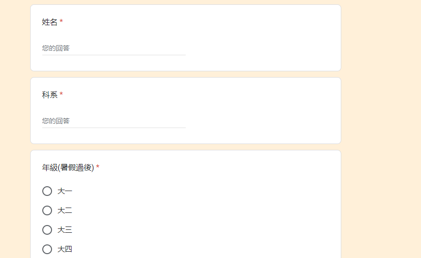
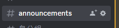
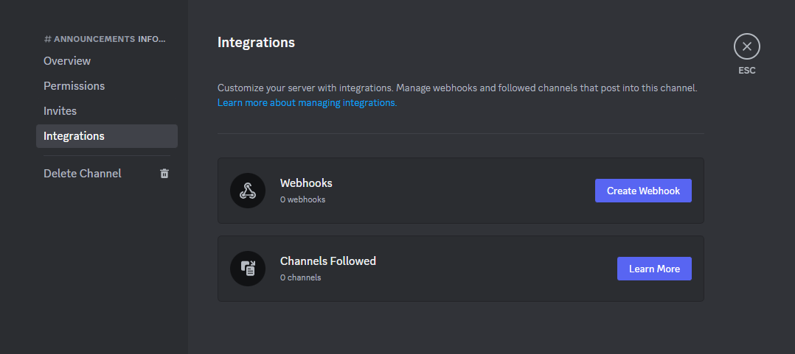
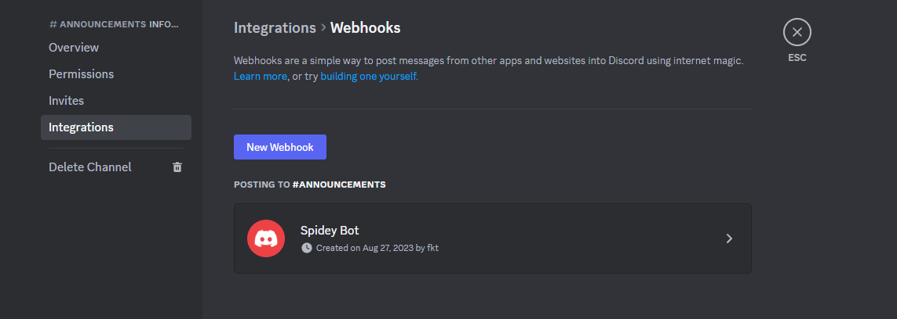
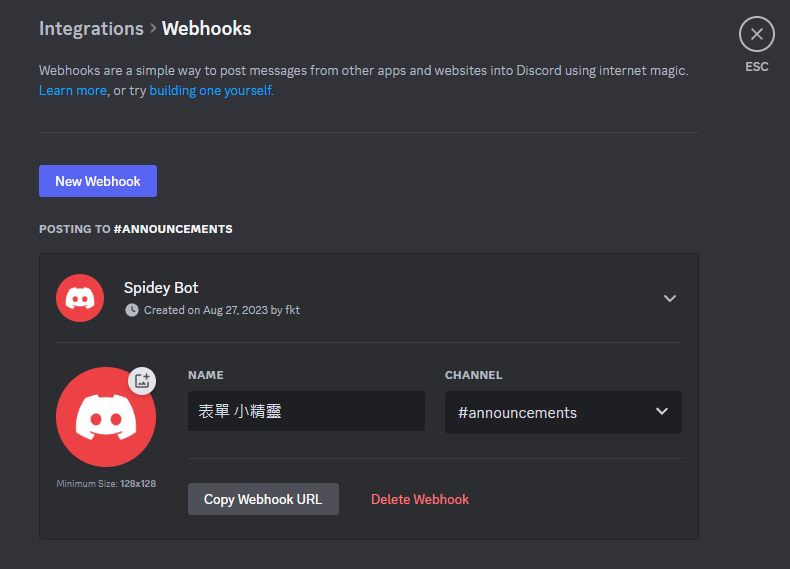
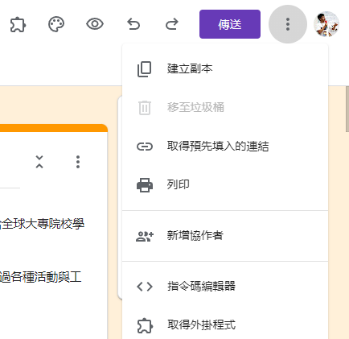

# CoreTeam-GoogleForm 雲林科技大學 GDSC Core Team 招募表單機器人

[NYUST GDSC CoreTeam 招生表單](https://docs.google.com/forms/d/e/1FAIpQLSfykA-Rgu5Bb647wVkIXBYq8XC1rzJAdMncVG-qIcEEQ4Oa0w/viewform)

[For Manager](https://docs.google.com/forms/d/1GbKmfS1klG_kJ3dbhiEFlSWTj1mBGXcv9mlnnNsiEcw/edit?ts=64d1d6db)

---

##  Core Technic 核心技術

- Google Form
- Google App Script
- Discord Webhook Bot

---

## Get Started 開始進行

### Step.1 建立 Google Form 

建立好 Google Form 樣式



### Step.2 根據 Google Form 表單取得需要的資料

範例程式

```javascript
    const response = e.response.getItemResponses();
    let items = [];

    for (const responseAnswer of response) {
        const question = responseAnswer.getItem().getTitle(); // 取得表單標題
        const answer = responseAnswer.getResponse(); //取得表單回應
        let parts = []

        try {
            parts = answer.match(/[\s\S]{1,1024}/g) || [];
        } catch (e) {
            parts = answer;
        }

        if (!answer) {
            continue;
        }

        for (const [index, part] of Object.entries(parts)) {
            if (index == 0) {
                items.push({
                    "name": question,
                    "value": part,
                    "inline": false
                });
            } else {
                items.push({
                    "name": question.concat(" (cont.)"),
                    "value": part,
                    "inline": false
                });
            }
        }
    }
```

---

### Step.3 建立發布通知的 Discord 頻道

編輯頻道資訊



找到 Integration 按下 Create Webhook



系統會自建一個基本的 Webhook Bot 給你



可以根據需求進行名稱修改，修改完畢記得 Copy Webhook URL



貼上至程式中的 Webhook 變數中

```javascript
const POST_URL = "<Your Webhook URL>";
```


### Step.4 將程式加入 Google Form

點選指令碼編輯器



貼上程式碼，大功告成 !!!

---

## 結語

若路過的朋友覺得這份專案還不錯，歡迎給予專案星星以及 Follow NYUST GDSC